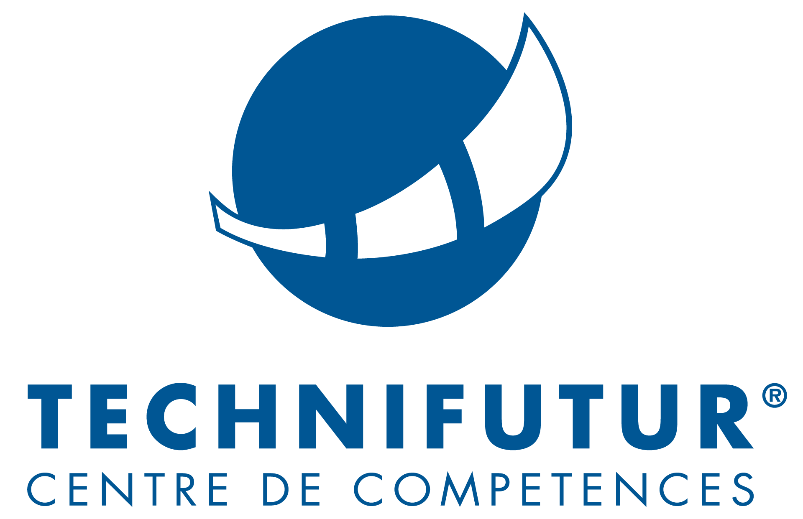
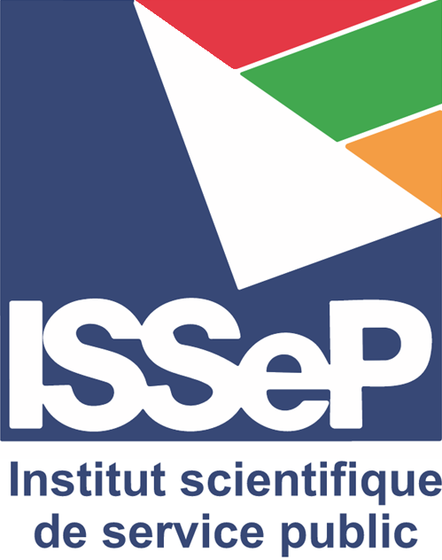

# Académiques

::: {.columns}
::: {.column width="20%"}
{width=80px}
:::

::: {.column width="80%"}
**Master Biodiversité, écologie et évolution **  
Muséum National d'Histoire Naturelle (MNHN) de Paris  
2016 - 2018
:::
:::
  
::: {.columns}
::: {.column width="20%"}
{width=80px}
:::

::: {.column width="80%"}
**Doctorat en Biologie **  
Université de Liège  
2019 - 2023
:::
:::

::: {.columns}
::: {.column width="20%"}
{width=80px}
:::
  
::: {.column width="80%"}
**Formation Data Analyst/Scientist (1360 heures)**  
Technifutur  
2024 - 2025
:::
:::

# Programmation

- Python
- R
- SQL
- Visualisations graphiques (Seaborn, ggplot2) et dashboard interactifs (plotly, PowerBI)
- Statistiques inférentiels (GLM, Mixed Model, GAM, GEE, PCA, lasso/elastic regression)  
Statistiques prédictifs (regression, classification, time series, clustering)
- Machine Learning (scikit-learn) & Deep Learning (PyTorch, TensorFlow/Keras)
- ETL (python: pandas & SQLAlchemy, PowerBI: Power Query)

# Professionnelles

::: {.columns}
::: {.column width="20%"}
{width=80px}
:::

::: {.column width="80%"}
**Collaborateur Scientifique Volontaire**  
MNHN, Paris  
2018 - 2019
:::
:::
  
::: {.columns}
::: {.column width="20%"}
{width=80px}
:::

::: {.column width="80%"}
**Chercheur Doctorant**  
Fond National pour la Recherche Scientifique / Uliège  
2019 - 2023
:::
:::

::: {.columns}
::: {.column width="20%"}
{width=80px}
:::
  
::: {.column width="80%"}
**Chef de projet**  
Institut Scientifique des Services Publics (ISSeP), Cellule Environnement Santé  
2025 - 2026
:::
:::