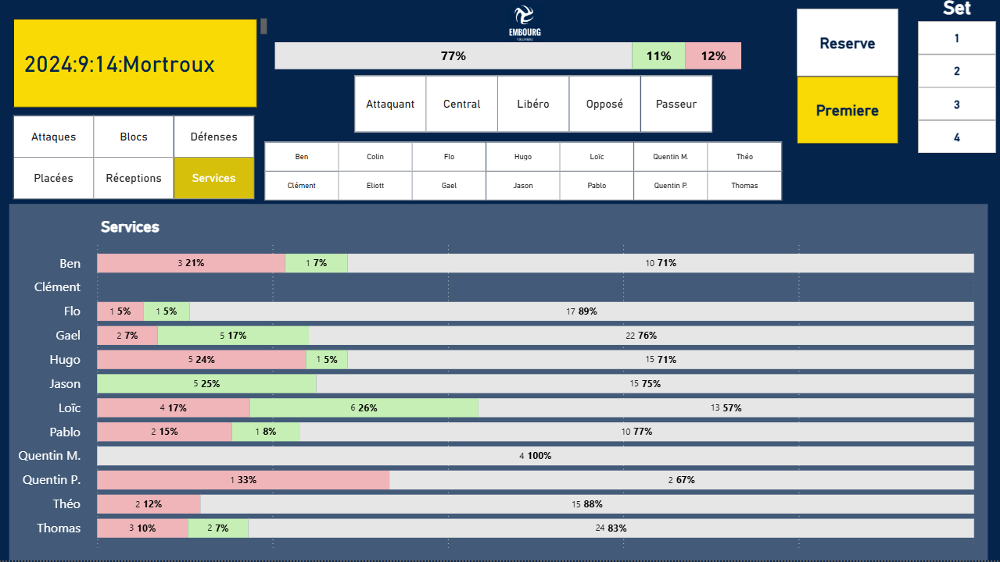
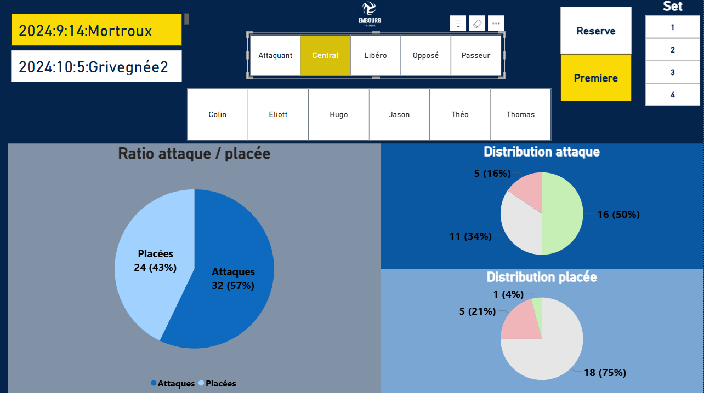
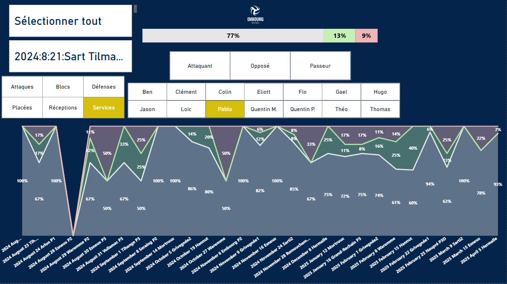
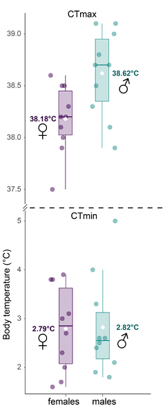
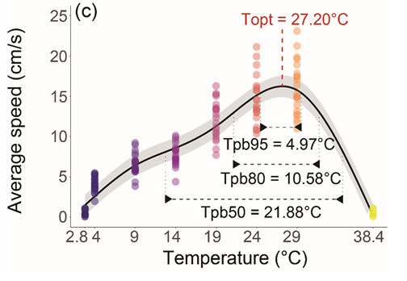
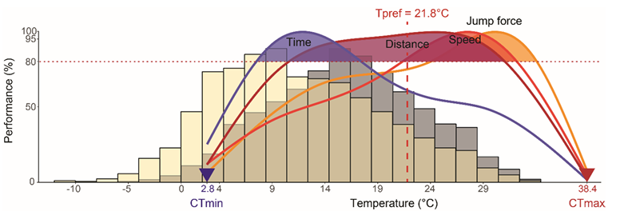
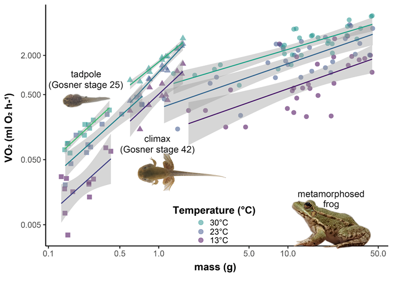

# Mes Projets

## Dashboard des statistiques d'une saison de volleyball

::: {.gallery-lightbox}
{fig-alt="Visualisation des touches/points/fautes suivant le type d'action en fonction du match, du joueur ou des différents postes dans l'équipe"}
{fig-alt="Statistiques plus spécifique permettant une meilleur évaluation des joueurs lors des matchs"}
{fig-alt="Evolution de chaque type d'action au cours de la saison pour chaque joueur."}
:::

## Figures d'articles scientifiques

::: {.gallery-lightbox}
{fig-alt="Boxplot"}
{fig-alt="Predictions d'un modèle non-linéaire (GAM)"}
{fig-alt="Figure de synthèse."}
{fig-alt="Graphique modélisant visuellement les intéractions entre prédicteurs."}
:::
